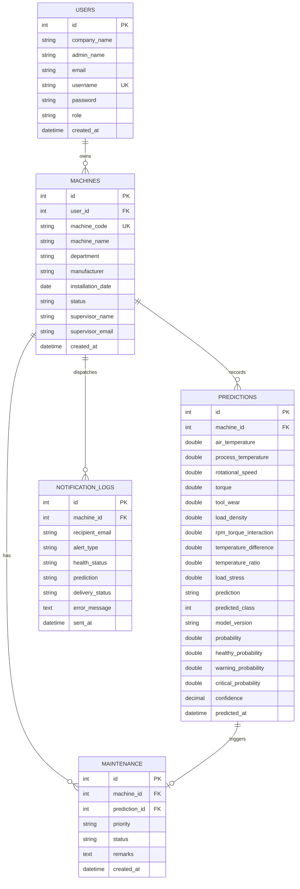

# PredictCNC — PostgreSQL Database Schema Specification

## Schema Design (PostgreSQL / psycopg2)

```mermaid
erDiagram
    USERS ||--o{ MACHINES : owns
    MACHINES ||--o{ PREDICTIONS : records
    MACHINES ||--o{ MAINTENANCE : has
    MACHINES ||--o{ NOTIFICATION_LOGS : dispatches
    PREDICTIONS ||--o| MAINTENANCE : triggers

    USERS {
        int id PK
        string company_name
        string admin_name
        string email
        string username UK
        string password
        string role
        datetime created_at
    }

    MACHINES {
        int id PK
        int user_id FK
        string machine_code UK
        string machine_name
        string department
        string manufacturer
        date installation_date
        string status
        string supervisor_name
        string supervisor_email
        datetime created_at
    }

    PREDICTIONS {
        int id PK
        int machine_id FK
        double air_temperature
        double process_temperature
        double rotational_speed
        double torque
        double tool_wear
        double load_density
        double rpm_torque_interaction
        double temperature_difference
        double temperature_ratio
        double load_stress
        string prediction
        int predicted_class
        string model_version
        double probability
        double healthy_probability
        double warning_probability
        double critical_probability
        decimal confidence
        datetime predicted_at
    }

    MAINTENANCE {
        int id PK
        int machine_id FK
        int prediction_id FK
        string priority
        string status
        text remarks
        datetime created_at
    }

    NOTIFICATION_LOGS {
        int id PK
        int machine_id FK
        string recipient_email
        string alert_type
        string health_status
        string prediction
        string delivery_status
        text error_message
        datetime sent_at
    }
```
